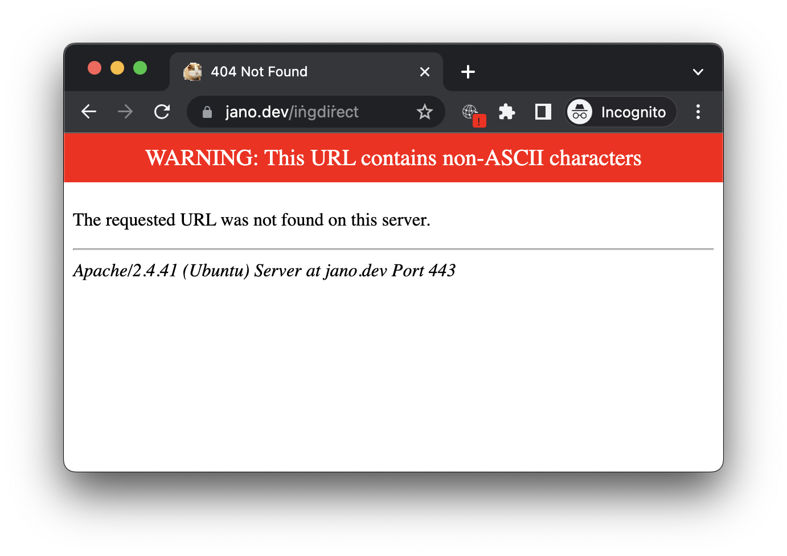

## Non-ASCII URL Checker

This Chrome extension monitors your browsing and overlays an alert when the current URL includes non-ASCII characters.

Its primary function is to act as a defense against a malicious tactic known as an [IDN Homograph Attack](https://en.wikipedia.org/wiki/IDN_homograph_attack), which misleads users about the website they're accessing.

To install it 

- browse to chrome://extensions, enable *Developer mode*
- click *Load unpacked* and browse to the folder extension

If you try to load a screen containing non-ASCII Unicode string you’ll see an overlay like this:

There are several kinds of misleading trickery you can do with Unicode domains:

- https://iṅg.com instead of the real bank ingdirect.com –I got one of these in the mail.
- https://github․com⁄apple⁄swift⁄archive⁄swift-5@.8-RELEASE.zip In this URL ․⁄ are not the ASCII characters ./ so everything to the left of the @ is interpreted as an user, and the domain is actually .8-RELEASE.zip

There are several ways to block these URLs: Little Snitch, [IDN-Safe](https://github.com/AykutCevik/IDN-Safe), or this extension. This extension works on any non-ASCII characters anywhere, so it may be triggered by legitimate URLs. In any case, the overlay is harmless. A limitation is that I can’t intercept URLs because Chrome manifest v3 only allows rules for static URLs –actually, I could do it with a v2 extension but they will be deprecated soon.